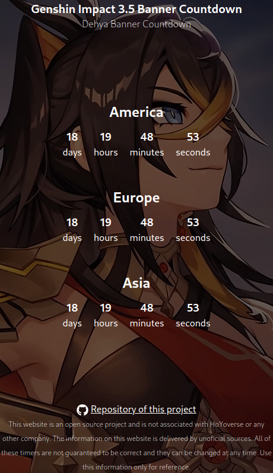

# Genshin Banner Countdown

Web page hosted in https://genshin-banner-countdown.netlify.app/ that show a countdown timer for the next banner in genshin impact for each server.

    

## API

This project has an API that allows you to access the Genshin Impact banner countdown data from a JSON file. The following routes are available:

## [/api](https://genshin-banner-countdown.netlify.app/api)
This route returns a list with all the data of previous and current times in the servers of America, Europe and Asia.

## [/api/actual](https://genshin-banner-countdown.netlify.app/api/actual)

This route returns the data of the current banner.

## [/api/rss](https://genshin-banner-countdown.netlify.app/api/rss)

This route returns the data of the current banner in RSS format.

